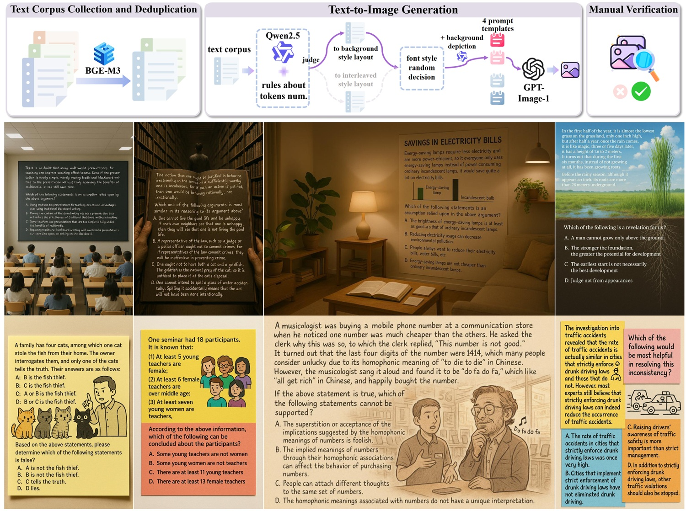
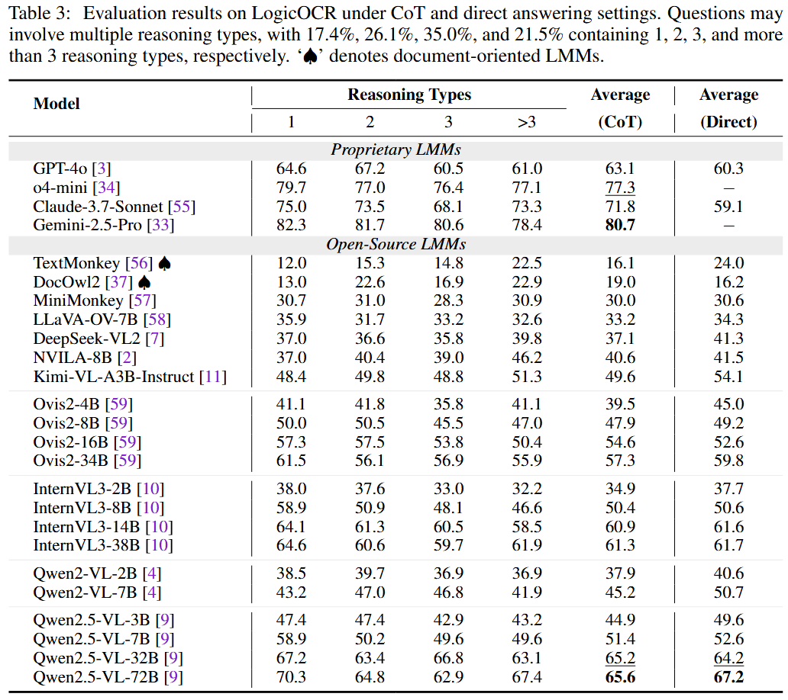

<p align="center">

  <h2 align="center"><strong>LogicOCR: Do Your Large Multimodal Models Excel at Logical Reasoning on Text-Rich Images?</strong></h2>

<div align="center">
<h5>
<em>Maoyuan Ye<sup>1</sup>, Jing Zhang<sup>1 ✉️</sup>, Juhua Liu<sup>1 ✉️</sup>, Bo Du<sup>1</sup>, Dacheng Tao<sup>2</sup> </em>
<br><sup>1</sup> Wuhan University   &emsp; <sup>2</sup> Nanyang Technological University</br>
</h5>
</div>

<h5 align="center">
<a href="https://arxiv.org/abs/"> </a> <a href="https://ymy-k.github.io/LogicOCR.github.io/"> </a> <a href="https://huggingface.co/datasets/MiliLab/LogicOCR"></a> <a></a>
</h5>

<figure>
<div align="center">

</div>
</figure>

# 👋 Introduction

We introduce LogicOCR, a benchmark comprising 1,100 multiple-choice questions designed to evaluate the logical reasoning abilities of Large Multimodal Models (LMMs) on text-rich images, while minimizing reliance on domain-specific knowledge (*e.g*., mathematics). We construct LogicOCR by developing a scalable, automated pipeline to convert raw text corpora into multimodal samples. First, we design prompt templates to steer GPT-Image-1 to generate images with diverse backgrounds, interleaved text-illustration layouts, and varied fonts, ensuring contextual relevance and visual realism. Then, the generated images are manually verified, with low-quality examples discarded. We evaluate a range of representative open-source and proprietary LMMs under both Chain-of-Thought (CoT) and direct-answer settings. 



# 📌 Key Findings

- **CoT does not consistently improve accuracy on LogicOCR**—most models fail to reason better step-by-step, suggesting flaws in their reasoning paths.
- **Test-time scaling significantly improves performance on LogicOCR, though the efficiency of open-source LMMs still leaves room for improvement**
- **State-of-the-art LMMs still fall short of fully integrating visual reading and reasoning.** While vision-language alignment suffices for perception tasks like OCR, **it remains inadequate for more complex reasoning, especially as model size grows.**
- **The perception robustness of LMMs across different visual-text orientations needs further improvement.** Perturbations like image rotation can reduce accuracy to near-random levels.

For main results and detailed analysis, please refer to the paper.


# 🔥 News

- **[`05/16/2025`]**: Release the dataset on [huggingface](https://huggingface.co/datasets/MiliLab/LogicOCR). Release the codes.


# 🔨 Evaluation

- **Setup**

Clone this repo and download the images and JSON file:

```bash
git clone https://github.com/MiliLab/LogicOCR
cd LogicOCR
wget https://huggingface.co/datasets/MiliLab/LogicOCR/resolve/main/images.zip
unzip images.zip && rm images.zip
wget https://huggingface.co/datasets/MiliLab/LogicOCR/resolve/main/LogicOCR.json
```

- **Recommed Environment**

python>=3.10, torch 2.5.1, torchvision 0.20.1, transformers 4.49.0, flash-attn 2.7.4.post1, and see [requirement.txt](requirements.txt)

- **Evaluate LMMs**

Some evaluation scripts are provided in [infer_models](infer_models).

```bash
bash eval.sh
```
You can also find the existing evaluation results in [huggingface repo](https://huggingface.co/datasets/MiliLab/LogicOCR/tree/main/main_results).

- **(Optional) Evaluate OCR and Two-Step Performance**

```bash
bash eval_ocr.sh
```
You can also find the existing OCR evaluation results in [huggingface repo](https://huggingface.co/datasets/MiliLab/LogicOCR/tree/main/ocr_then_answer_results).


# ▶️ Text-to-Image Generation

If you want to generate images in yourself, a [JSON file](gen_images/samples.json) with 3 samples and a simple script are provided for reference. You can run the following commands. The generated images will be saved in `gen_images/saved_folder`
```bash
cd gen_images
python gpt_generate.py samples.json $YOUR_API_KEY $YOUR_BASE_URL $NUM_WORKERS
```

# 📖 Main Results


# 📜 License
LogicOCR is licensed under [CC BY-NC-SA 4.0](https://creativecommons.org/licenses/by-nc-sa/4.0/).

# 💗 Acknowledgement
The raw text corpora are collected from [LogiQA](https://github.com/lgw863/LogiQA-dataset) and [LogiQA2.0](https://github.com/csitfun/LogiQA2.0).

The inference script is modified from [OCRBench](https://github.com/Yuliang-Liu/MultimodalOCR). The OCR evaluation tool is modified from [Fox](https://github.com/ucaslcl/Fox).

# :black_nib: Citation

If you find LogicOCR helpful, please consider giving this repo a :star: and citing:

```latex
@article{ye2025logicocr,
  title={LogicOCR: Do Your Large Multimodal Models Excel at Logical Reasoning on Text-Rich Images?},
  author={Maoyuan Ye and Jing Zhang and Juhua Liu and Bo Du and Dacheng Tao},
  journal={arXiv preprint arXiv:},
  year={2025}
}
```